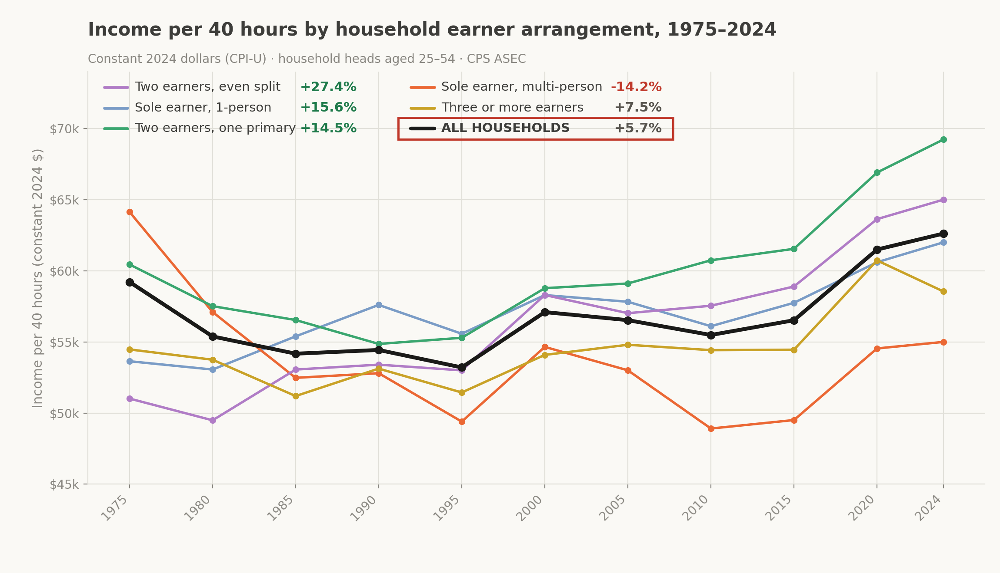

# Income per 40 hours

By **[PendulHaos](https://www.youtube.com/@PendulHaos)** · CC BY 4.0

A household-hours-normalised measure of real earnings in the United States, income years 1975 to 2024.

Standard income statistics count a household with two people working full time the same as a household with one earner. Since the number of earners per household changed substantially over this period, those statistics stop being comparable across time. Part of what looks like income growth is a household selling more labour, not being paid more for it.

This measure divides household earnings by household hours worked and expresses the result as what one full-time work-year returns. A 1975 single-earner household and a 2024 dual-earner household can then be compared on the same basis.



## The result

For US households headed by someone aged 25 to 54, income per 40 hours rose from **$59,214 to $62,618** in constant 2024 dollars between 1975 and 2024 - **+5.7% over 49 years**, or 0.114% a year.

Over the same period, median household hours rose 20%, from 2,600 to 3,120 a year.

The aggregate conceals a wide spread across household types:

| Household arrangement | Share 1975 | 1975 | 2024 | Change |
|---|---|---|---|---|
| Two earners, even split | 9.3% | $51,018 | $65,000 | **+27.4%** |
| Sole earner, 1-person | 10.7% | $53,642 | $62,000 | +15.6% |
| Two earners, one primary | 32.1% | $60,446 | $69,231 | +14.5% |
| Three or more earners | 14.5% | $54,473 | $58,545 | +7.5% |
| Sole earner, multi-person | 33.4% | $64,137 | $55,000 | **-14.2%** |
| **All households** | | **$59,214** | **$62,618** | **+5.7%** |

The single-earner household with dependents, the most common arrangement in 1975, at a third of all working households, is the only one whose real return per hour of work fell. It also began the period as the best-paid arrangement and ended as the worst.

There is a comparable gradient by age. Households headed by someone aged 25 to 34 are flat across the full 49 years at -0.1%; the 35-44 band gained 5.1% and the 45-54 band 11.5%.

## How it is calculated

For each household: total earnings from work, divided by total hours everyone in it worked, scaled to a 40-hour week.

```
IPF = (household earnings ÷ household hours) × 2080
```

| | Earners | Hours | Earned | Per 40 hours |
|---|---|---|---|---|
| Household A | 1 | 2,080 | $60,000 | **$60,000** |
| Household B | 2 | 4,160 | $120,000 | **$60,000** |
| Household C | 2 | 4,160 | $90,000 | **$45,000** |

A and B bring home very different amounts, but B is selling twice as much labour to do it; the rate is identical. C is the household that actually lost ground.

Source is the Current Population Survey ASEC via IPUMS, roughly 1.9 million person records. Earnings are wages plus self-employment and farm income; benefits and transfers are excluded. Deflated with published CPI-U.

## What is in this repository

| | |
|---|---|
| [`income-per-40-hours-methodology.md`](income-per-40-hours-methodology.md) | Full methodology, results, robustness and limitations |
| [`DATA.md`](DATA.md) | How to obtain the CPS extract, free, about five minutes |
| `analysis.py` | Complete pipeline; reproduces every figure from the extract |
| `output/headline.csv` | Two-point comparison by earner arrangement |
| `output/series.csv` | Eleven-point series, 1975-2024 |
| `output/age_bands.csv` | By age of household head |
| `output/robustness.csv` | Specification sensitivity |
| `charts/` | Figures |

## Running it

The CPS extract is not included; IPUMS terms require permission to redistribute it. `DATA.md` explains how to build your own, which is free.

```bash
python analysis.py data/cps_extract.dat
```

Requires Python 3 with `numpy` and `pandas`. Writes all four CSVs to `output/` and prints the headline and robustness figures.

## Scope and caveats

This is not a competing aggregate. Its hourly equivalent, $28.47 rising to $30.10 in constant 2024 dollars, falls inside the range of published real median hourly compensation series, which is the expected result and a check that the construction is sound. What it adds is the household as the unit of observation: worker-level series cannot express how households are organised, because the household is not an entity in that data.

Three things a reader should know before using the headline:

- **It is close to zero, and adjustments move it in both directions.** Correcting for the higher inflation faced by middle-income households would take it to -1.7%; adjusting for falling household size would take it to +20.2%. Neither is applied. Both are documented in the methodology, with the reasoning for declining each.
- **The deflator is a choice.** Published CPI-U produces the largest measured gain of the three defensible options, and is used for consistency across the span rather than because it favours any conclusion. R-CPI-U-RS gives +15.8% and the Census spliced series +24.1%.
- **Implementation details do not change it much.** Across every coding variant tested: median rule, earner age floor, category boundaries, treatment of losses and top-codes, the result stays between +5.1% and +6.8%.

Everything above is argued in full, with the numbers, in the methodology document.

## Citation

**To cite this work:**

PendulHaos (2026). *Income per 40 hours: a household-hours-normalised measure of real earnings in the United States, 1975-2024.*
https://github.com/PendulHaos/Income-Per-40hr-Methodology

**Data sources:** IPUMS CPS, University of Minnesota, www.ipums.org. Source
data provided by the US Census Bureau and the Bureau of Labor Statistics.
Price index: BLS series CUUR0000SA0.

Reproduction is welcome and the method is published so results can be checked.
If you use the measure, the derived data or the methodology, please cite as above.